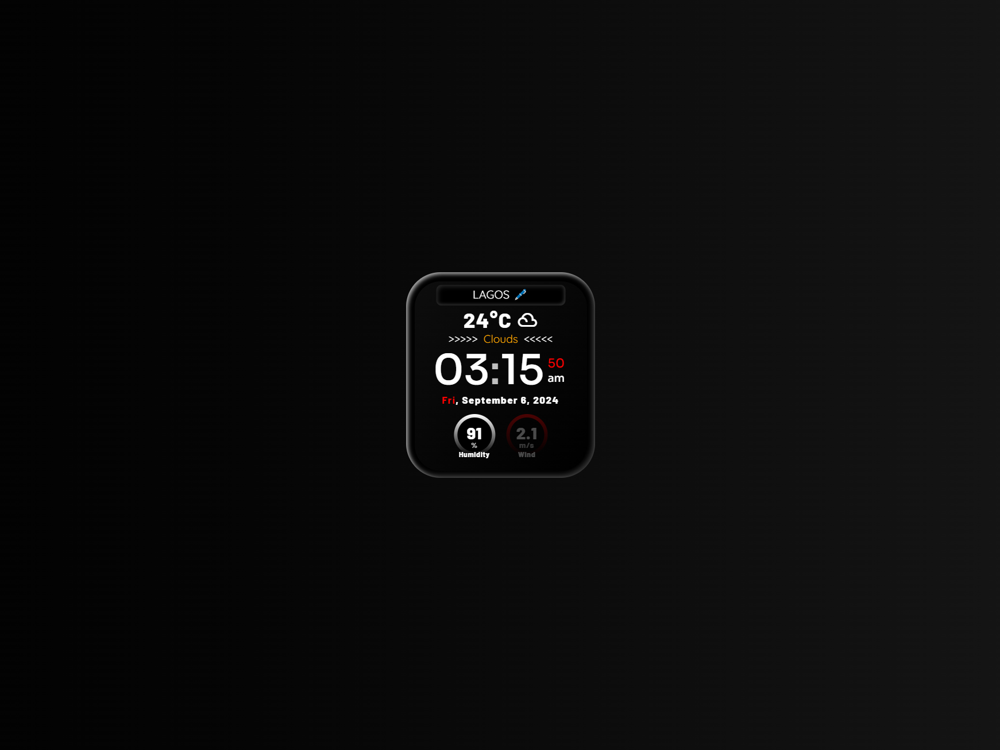

# digitalWatch

 A unique digital watch with a sprinkle of spice (16 March, 2023)



<!-- **[Original Code Here](https://www.sololearn.com/en/compiler-playground/WcWtAWq05TaB)** -->
<bold><a href="https://www.sololearn.com/en/compiler-playground/WcWtAWq05TaB?ref=app" target="_blank">Original Code Here</a></bold>

### Run Locally

1. Clone the repository:

```bash
git clone https://github.com/cryptic-bmd/digitalWatch.git
```

2. Navigate to the directory:

```bash
cd digitalWatch
```

3. Create a virtual environment:

-   On macOS and Linux:

```bash
python3 -m venv venv
```

-   On Windows:

```bash
python -m venv venv
```

4. Activate the virtual environment:

-   On macOS and Linux:

```bash
source venv/bin/activate
```

-   On Windows:

```bash
venv\Scripts\activate
```

5. Install the dependencies:

-   On macOS and Linux:

```bash
pip3 install -r requirements.txt
```

-   On Windows:

```bash
pip install -r requirements.txt
```

6. Run

-   On macOS and Linux:

```bash
python3 main.py
```

-   On Windows:

```bash
python main.py
```
