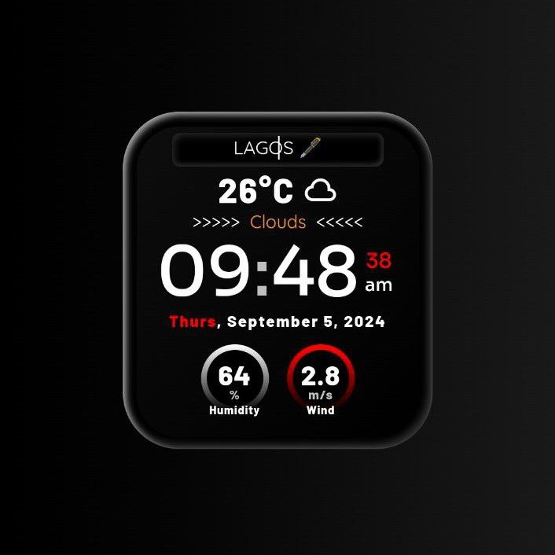

# digitalWatch

 A unique digital watch with a sprinkle of spice



**[Original Code Here](https://www.sololearn.com/en/compiler-playground/WcWtAWq05TaB)**

### Run Locally

1. Clone the repository:

```bash
git clone https://github.com/cryptic-bmd/digitalWatch.git
```

2. Create a virtual environment:

-   On macOS and Linux:

```bash
python3 -m venv venv
```

-   On Windows:

```bash
python -m venv venv
```

3. Activate the virtual environment:

-   On macOS and Linux:

```bash
source venv/bin/activate
```

-   On Windows:

```bash
venv\Scripts\activate
```

4. Install the dependencies:

-   On macOS and Linux:

```bash
pip3 install -r requirements.txt
```

-   On Windows:

```bash
pip install -r requirements.txt
```

5. Run

-   On macOS and Linux:

```bash
python3 main.py
```

-   On Windows:

```bash
python main.py
```
